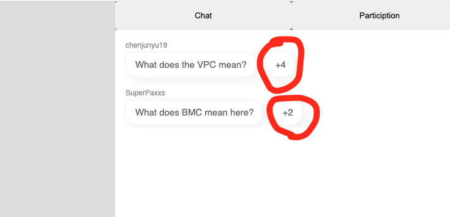
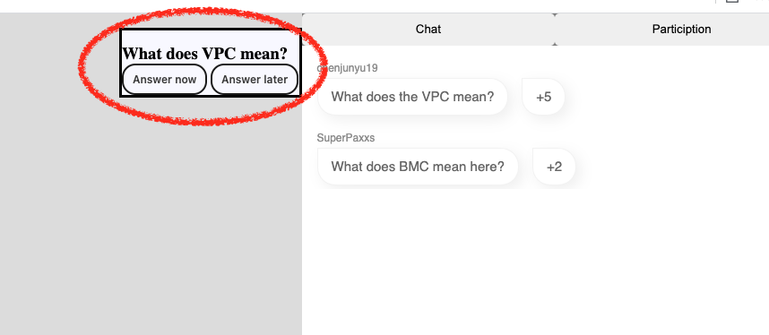
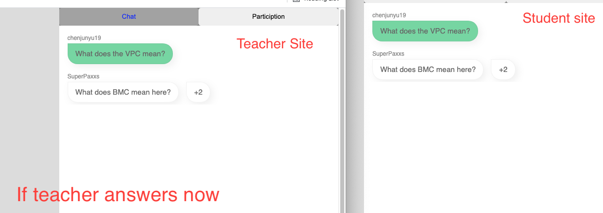
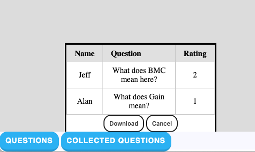
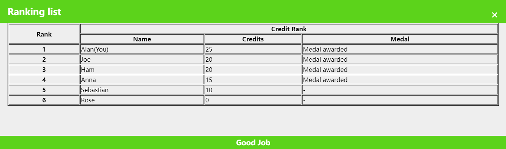
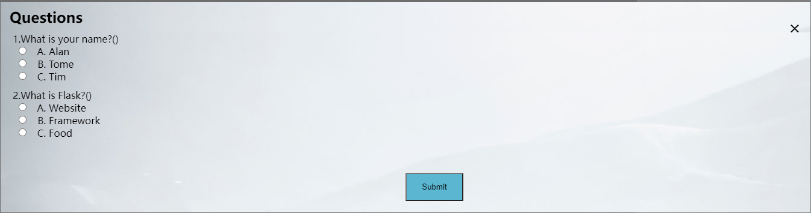
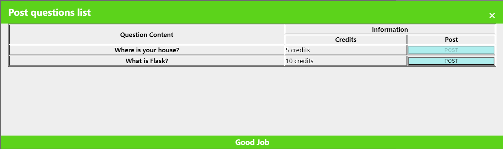

# Innovation Team 6 Project Repository
This repository is set up for Unimelb Technology Innovation Project (INFO90010).

# Instruction

This part is the instruction of how to use the prototype.

## Preparation

- Prepare **Chrome** browser.
- Open "home_page.html" **two times** (one for student and one for teacher).
  - For student, click "Student" -> "Start Class"
  - For teacher, click "Teacher" -> "Start Class"

You should be able to see two pages in diffrernt tabs now. One is called "**page for students**". The other one is called "**page for teachers**".

## Functions

### Question rating & highlight

- [Student] Student clicks "+2" or "+4" button. The numbers will increase accordingly, indicating that these questions are voted by this student.

  

- [Teacher] Simultaneously, in teacher's site, there will be a highlighed window with a question on the top-right side, indicating that this question is a popular question and it is highlighted in teahcer's side (note: the current definition a famous question is that if a question if voted for 5 times, it will be marked as a famous question).

  

- [Teacher] The teacher can choose to answer it now or later. If answer it now, teacher can click "Answer now" button and the color of that question will be changed to green in both teacher's site and student's site, indicating that this question is answered and will not be recorded. If clicks "Answer later", the question will be recorded. (note: "Answer now" and "Answer later" can only be selected for one time. If you choose "Answer now" this time and want to know what will happen if choosing "Answer later", you need to refresh the page for both student's site and teacher's site and vote the question as a student again)

  

### Question collection

- [Stundet] Student types any question with a "?" symbol in the end and clicks "Send" button. The teacher's site and student's site will display the content accordingly.

- [Teacher] Teacher clicks "Collected Question" button and it will display all recorded questions collected from the chatbox. You can click the "Download" button and theses questions will be exported to your local device as an excel file. You can open it to check the content.

  

### Credit function

- [Stundet] Student clicks the "Answer Question" button. You can answer current questions from teachers,and you also can click the "Rank" button to check current credits.

  

  
  
- [Teacher] Teacher clicks "Question" button to post latest questions to students.

  

### Publish percentage information

- [Stundet/Teacher] They can click "Particiption" button in chat box, where displays the answered questions percentage of current teacher. 

  
